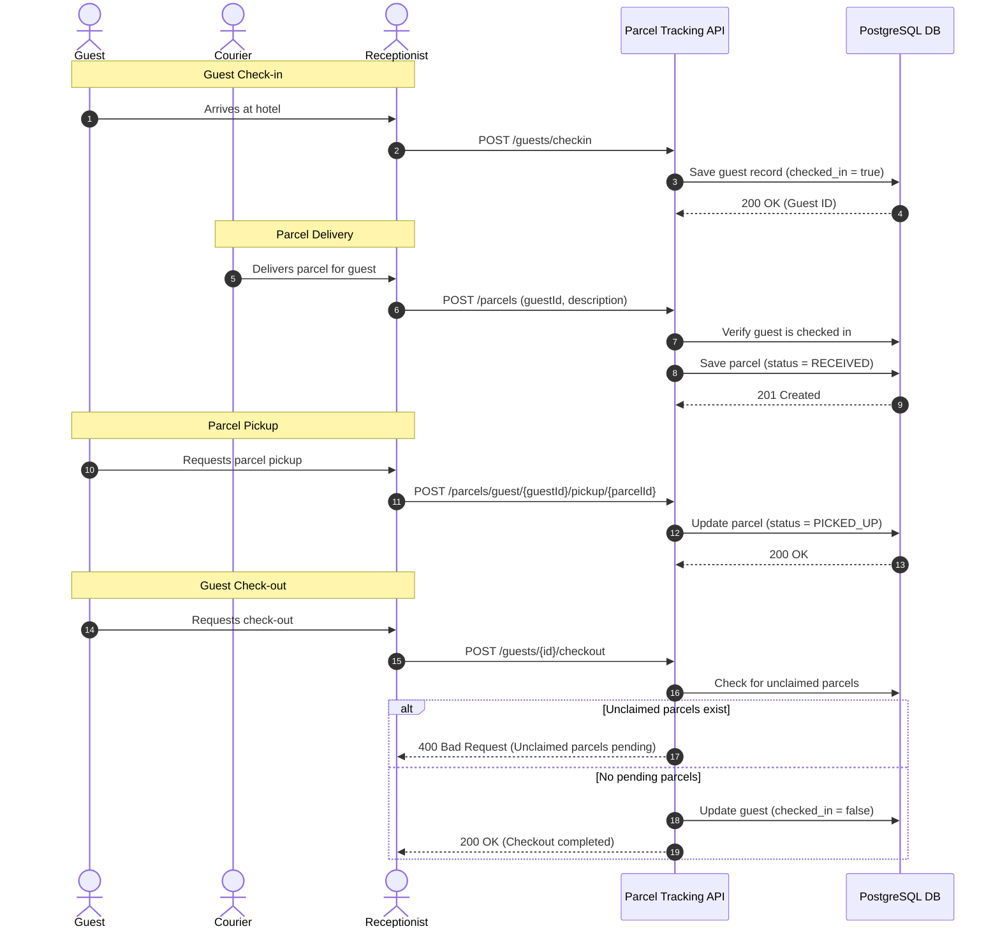

# 📦 Parcel Tracking Backend

[](LICENSE)
[](https://openjdk.org/projects/jdk/17/)
[](https://spring.io/projects/spring-boot)
[](https://github.com/hieuCM2895/Parcel_Tracking/releases)
[](https://github.com/hieuCM2895/Parcel_Tracking/actions)

An open-source, production-ready Spring Boot backend service designed for hospitality environments (hotels, serviced apartments, co-living spaces) to streamline guest parcel reception, real-time status tracking, and check-out validation.

---

## 📑 Table of Contents

- [Overview](#-overview)
- [Workflow Architecture](#-workflow-architecture)
- [Features](#-features)
- [Tech Stack](#-tech-stack)
- [Getting Started](#-getting-started)
  - [Prerequisites](#prerequisites)
  - [Database Setup with Docker](#1-database-setup-with-docker)
  - [Running the Application](#2-running-the-application)
  - [Interactive API Documentation (Swagger)](#3-interactive-api-documentation-swagger)
- [API Reference](#-api-reference)
- [Testing](#-testing)
- [Roadmap](#-roadmap)
- [Contributing](#-contributing)
- [Releases](#-releases)
- [License](#-license)

---

## 🌟 Overview

Front desk staff and concierges handle hundreds of delivery parcels daily. Traditional pen-and-paper or disjointed spreadsheets cause misplaced packages, delays, and checkout disputes. 

**Parcel Tracking Backend** provides a structured, automated RESTful service that:
- Ensures parcels can only be accepted for currently registered/checked-in guests.
- Prevents guests from checking out if they still have unclaimed packages.
- Provides atomic state transitions for parcel pickup and guest lifecycles.
- Delivers a fully documented, test-driven API ready for web and mobile frontends.

---

## 🔄 Workflow Architecture



---

## 🚀 Features

- **Guest Lifecycle Management**: Seamless check-in, status checks, and safe check-out flows.
- **Parcel Ingestion & Tracking**: Associate incoming deliveries with verified guests.
- **Validation Guardrails**:
  - Rejects parcel deliveries for non-existent or checked-out guests.
  - Prevents guest checkout if unclaimed parcels remain at the reception.
- **API Documentation**: Built-in Swagger UI and OpenAPI 3.0 specs.
- **Robust Error Handling**: Structured, standardized error response schemas with distinct error codes.
- **Production-Ready Persistence**: PostgreSQL support with JPA/Hibernate entity relationships.
- **CI/CD Integration**: Automated testing via GitHub Actions.

---

## 🧰 Tech Stack

| Component | Technology | Description |
| :--- | :--- | :--- |
| **Language** | Java 17 (LTS) | Modern Java runtime |
| **Framework** | Spring Boot 3.1.4 | Core framework, dependency injection & REST |
| **Persistence** | Spring Data JPA / Hibernate | Object-relational mapping |
| **Database** | PostgreSQL / H2 | PostgreSQL (production), H2 (in-memory test DB) |
| **Boilerplate** | Project Lombok | Reduced getter/setter boilerplate |
| **API Docs** | Springdoc OpenAPI 2.1.0 | OpenAPI 3.0 & Swagger UI |
| **Build Tool** | Gradle 8.3 | Dependency & build lifecycle management |
| **Container** | Docker | Containerized database and service deployment |
| **Testing** | JUnit 5 & Spring MockMvc | Unit & integration testing |

---

## ▶️ Getting Started

### Prerequisites

- **Java Development Kit (JDK)**: Version 17 or later
- **Docker**: Optional, for running PostgreSQL in a container
- **Git**: For version control

### 1. Database Setup with Docker

You can spin up the PostgreSQL database using the included Docker configuration:

```bash
# Build the PostgreSQL container image
docker build -t parcel-postgres .

# Run the database container
docker run -d -p 5432:5432 --name parcel-db parcel-postgres
```

Or connect to an existing local/remote PostgreSQL instance by configuring `src/main/resources/application.yaml`:

```yaml
spring:
  datasource:
    url: jdbc:postgresql://localhost:5432/parcel_db
    username: postgres
    password: your_password
```

### 2. Running the Application

Using the Gradle wrapper:

```bash
./gradlew bootRun
```

The application will start on port `8080` by default (`http://localhost:8080`).

### 3. Interactive API Documentation (Swagger)

Once the application is running, open your browser to:

```text
http://localhost:8080/swagger-ui/index.html
```

You can inspect all available endpoints, schemas, and execute live API calls directly from the browser.

---

## 📚 API Reference

### Guest Endpoints

| Method | Endpoint | Description | Sample Request Body |
| :--- | :--- | :--- | :--- |
| `POST` | `/guests/checkin` | Check-in a new guest | `{"fullName": "John Doe"}` |
| `POST` | `/guests/{id}/checkout` | Check-out a guest (verifies no unclaimed parcels) | *None* |
| `GET` | `/guests/{id}/status` | Retrieve guest's current check-in status | *None* |

### Parcel Endpoints

| Method | Endpoint | Description | Sample Request Body |
| :--- | :--- | :--- | :--- |
| `POST` | `/parcels` | Ingest and receive a parcel for a guest | `{"guestId": "1", "description": "Amazon box"}` |
| `GET` | `/parcels/guest/{guestId}` | List all parcels associated with a guest | *None* |
| `POST` | `/parcels/guest/{guestId}/pickup/{parcelId}` | Mark a parcel as picked up by the guest | *None* |

### Error Response Schema

All errors return a standardized JSON structure:

```json
{
  "error": "guest-404",
  "message": "Guest not found",
  "detail": "Guest with ID 999 not found"
}
```

Common error codes:
- `guest-404`: Guest ID not found.
- `parcel-404`: Parcel ID not found.
- `guest-checked-out`: Attempted to receive a parcel for a guest who has already checked out.
- `unclaimed-parcels`: Attempted to check out a guest with pending unclaimed packages.
- `parcel-ownership-mismatch`: Parcel does not belong to the specified guest.

---

## 🧪 Testing

The project includes unit and integration tests covering controllers, service validations, and database interactions.

Run tests using:

```bash
./gradlew test
```

Test reports are generated at:
```text
build/reports/tests/test/index.html
```

---

## 🗺️ Roadmap

Current development priorities tracked in public issues:

- [ ] **OCR Pipeline**: Add computer-vision / OCR pipeline for automated parcel shipping label scanning and guest matching ([Issue #1](https://github.com/hieuCM2895/Parcel_Tracking/issues)).
- [ ] **Test Coverage Expansion**: Increase MockMvc test coverage for edge cases during checkout and concurrent pickups ([Issue #2](https://github.com/hieuCM2895/Parcel_Tracking/issues)).
- [ ] **Notification Webhooks**: Integrate SMS / Email / Webhook triggers upon parcel arrival.
- [ ] **Multi-tenant Support**: Support multiple hotel branches and concierge locations within a single instance.

---

## 🤝 Contributing

Contributions are welcome! Please read [CONTRIBUTING.md](CONTRIBUTING.md) for details on our code of conduct, development workflow, and submitting pull requests.

---

## 📦 Releases

All release tags and release notes are maintained under the [Releases](https://github.com/hieuCM2895/Parcel_Tracking/releases) section. See [CHANGELOG.md](CHANGELOG.md) for detailed version history.

---

## 📄 License

This project is licensed under the **MIT License** - see the [LICENSE](LICENSE) file for details.
